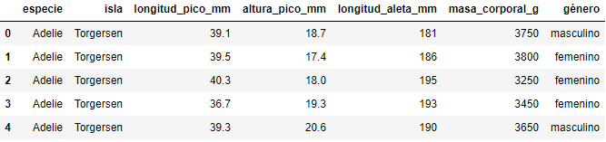
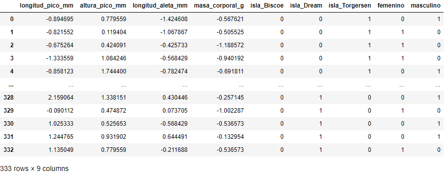
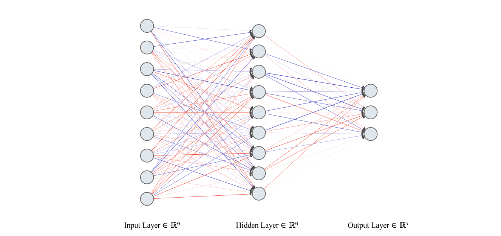

# Red Neuronal Multicapa - aprendizaje supervisado por Retro-propagación

## Pequeño Vistazo

**poner .gif de GUI** en funcionamiento


## Dataset

El dataset utilizado se llama `penguins`, y se trata de una versión limpia y procesada del dataset original `Palmer Archipelago (Antarctica) penguin data`. Esta versión se encuentra en el proyecto bajo el nombre `penguins_cleaned.csv`, en donde se han descartado los registros con valores nulos. La versión completa del dataset original está disponible [Aquí](https://github.com/allisonhorst/palmerpenguins).

### Procesamiento de dataset 📋

Se ha utilizado una versión personalizada del dataset. Editada para la predecir la clasificación de pingüinos según su especie a partir de 6 atributos: (longitud de pico, altura de pico, longitud de aleta, masa corporal, isla donde habita, y género)

El dataset utilizado (disponible [aquí](https://github.com/CFSanchezV/TB2-RNAs/blob/master/penguins_cleaned.csv)), tiene la siguiente estructura:

``` r
head(penguins)
```


El formato de dataset de entrada utilizado se muestra a continuación. Se usa la codificación **One-hot** para convertir datos categóricos (la especie, isla y género) en datos numéricos para su procesamiento y uso en la red neuronal.



**Nótese que:** 
* Los valores han sido normalizados como parte de la preparación para el aprendizaje automático. El objetivo es cambiar los valores de las columnas numéricas para usar una escala común, sin distorsionar diferencias en los rangos ni perder datos.
* En el código fuente, se ha mantenido la data en su idioma de origen (inglés). "**bill depth**" y "**bill length**" significan altura de pico y longitud de pico respectivamente

## Arquitectura de red 🔧



Una red neuronal multicapa que consiste en una capa de entrada, una oculta y una de salida. Los 9 nodos de la capa de entrada corresponden a los 5 atributos utilizados del dataset procesado. Asimismo, la capa oculta tiene 9 nodos y la capa de salida tiene 3, las cuales corresponden a las 3 clasificaciones únicas de especies de pingüino.


## Comenzando 🚀

_Estas instrucciones permitirán obtener una copia del proyecto en funcionamiento en una máquina local._

Debe de asegurarse de tener "Python" instalado en su ordenado desde la versión 3.0 para adelante y el instalador de paquetes "pip" o "conda" también en su versión más actualizada.


### Pre-requisitos 🛠️

_Este proyecto utiliza propiedades de estas librerías para la lectura y procesamiento de datos_ 

```
Pandas
Numpy
```

* [Pandas](https://pandas.pydata.org/docs/) - Documentación de pandas
* [Numpy](https://numpy.org/doc/) - Documentación de numpy


### Instalación 🔧

_Clonación del repositorio_

```bash
git clone https://github.com/CFSanchezV/TB2-RNAs.git
```

#### Windows 10

_Instalación de librerías en Windows 10_

```bash
pip install pandas
pip install numpy
```

#### Linux dist.

_Instalación de librerías en Linux_

```bash
sudo apt-get install python3-pandas
pip install numpy
```


## Autores ✒️

* **Christian Sanchez** 
* **Fernando Valdiviezo** 
* **Frank Zegarra** 